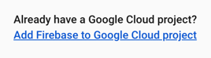
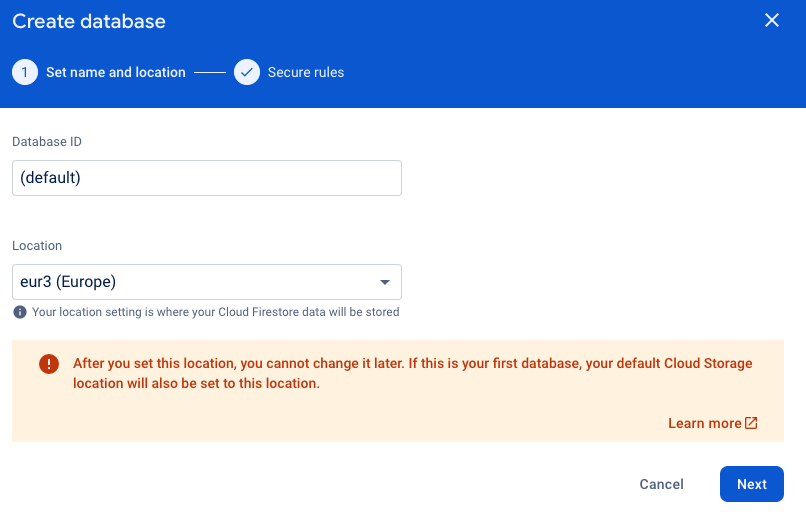

# Übungsaufgabe: Firestore-Beispieldaten per CLI

In dieser Übungsaufgabe werden Sie ein CLI-Tool entwickeln, das mithilfe der
Datafaker-Library Beispieldaten generiert und in eine Google Cloud
Firestore-Datenbank hochlädt.

## Firebase und Firestore einrichten

Sollten Sie noch kein Firebase-Projekt für Ihr aktuelles GCP-Projekt haben,
legen Sie wie folgt eines an:

Gehen Sie zur [Firebase-Konsole](https://console.firebase.google.com/u/0/) und
beginnen Sie mit der Einrichtung eines neuen Projekts.
Geben Sie an, dass Sie das Projekt mit einem bestehenden GCP-Projekt verbinden
möchten.



Klicken Sie auf das Eingabefeld für den Projektnamen und wählen Sie das
GCP-Projekt aus, mit dem Sie Firebase verknüpfen wollen.


Bestätigen Sie nun in den folgenden Schritten des Wizards den Bezahlplan
(Blaze - Pay As You Go) und lassen Google Analytics deaktiviert.
Nach einiger Wartezeit finden Sie sich in der Firebase-Konsole wieder.


Wechseln Sie im Menü links auf "Firestore Database"


Legen Sie eine neue Datenbank "(default)" an und wählen Sie "europe" als
Location.



Wählen Sie im folgenden Schritt "production mode" und warten danach darauf,
dass die Datenbank angelegt wurde.

## Schritt 1: Projekt-Setup

Erstellen Sie ein neues Node.js-Projekt.

```shell
mkdir firestore-uploader
cd firestore-uploader
npm init -y
```

## Schritt 2: Abhängigkeiten hinzufügen

Installieren Sie die notwendigen Abhängigkeiten für Google Cloud Firestore und
Faker.js.

```shell
npm install --save @google-cloud/firestore @faker-js/faker
```

## Schritt 3: Code für das Hochladen von Daten in Firestore

Fügen Sie den folgenden Code in eine neue Datei namens `firestoreUploader.js`
ein:

```javascript
const { Firestore } = require('@google-cloud/firestore');
const { faker } = require('@faker-js/faker');

// Firestore initialisieren
const db = new Firestore();

async function uploadRandomData() {
    const data = {
        name: faker.person.fullName(),
        email: faker.internet.email(),
        address: faker.location.streetAddress(),
        phoneNumber: faker.phone.number(),
    };

    const docRef = db.collection('addresses').doc();
    const result = await docRef.set(data);

    console.log('Document added with ID:', docRef.id);
    console.log('Data:', data);
}

uploadRandomData().catch(console.error);
```

## Schritt 4: Ausführung des Tools

Führen Sie das Tool aus:

```shell
node firestoreUploader.js
```

## Prüfen des Ergebnisses

Gehen Sie zurück in die Cloud-Firestore-Konsole, wo Sie zuvor die Datenbank
angelegt haben. Sie sollten nun eine neue Collection "addresses" mit einem
neuen Dokument sehen.
