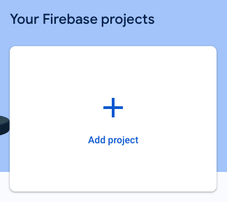
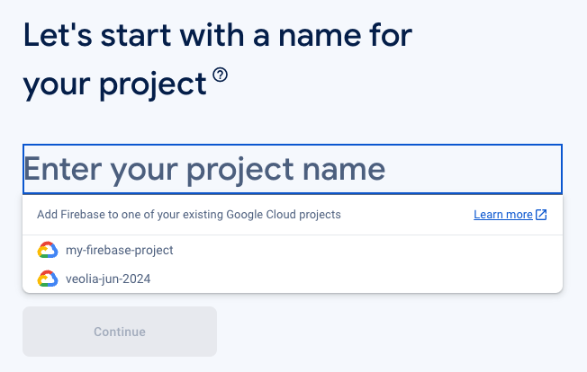
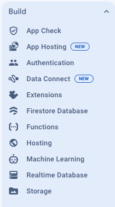

# Übungsaufgabe: Java-CLI zum Hochladen von Beispieldaten in eine Google Cloud Firestore-Datenbank

In dieser Übungsaufgabe werden Sie ein Java-CLI-Tool entwickeln, das mithilfe der Datafaker-Library Beispieldaten generiert und in eine Google Cloud Firestore-Datenbank hochlädt. Das Projekt wird als Maven-Projekt aufgebaut.

## Firebase und Firestore einrichten

Sollten Sie noch kein Firebase-Projekt für Ihr aktuelles GCP-Projekt haben, legen Sie wie folgt eines an:

Gehen Sie zur [Firebase-Konsole](https://console.firebase.google.com/u/0/) und beginnen Sie mit der Einrichtung eines neuen Projekts.



Klicken Sie auf das Eingabefeld für den Projektnamen und wählen Sie das GCP-Projekt aus, mit dem Sie Firebase verknüpfen wollen.



Bestätigen Sie nun in den folgenden Schritten des Wizards den Bezahlplan (Blaze - Pay As You Go) und lassen Google Analytics deaktiviert.
Nach einiger Wartezeit finden Sie sich in der Firebase-Konsole wieder.


Wechseln Sie im Menü links auf "Firestore Database"



Legen Sie eine neue Datenbank "(default)" an und wählen Sie "europe" als Location.


Wählen Sie im folgenden Schritt "production mode" und warten danach darauf, dass die Datenbank angelegt wurde.


## Maven Projekt-Setup
Erstellen Sie ein neues Maven-Projekt.

```sh
mvn archetype:generate -DgroupId=com.example -DartifactId=firestore-uploader -DarchetypeArtifactId=maven-archetype-quickstart -DinteractiveMode=false
cd firestore-uploader
```

## Abhängigkeiten hinzufügen
Öffnen Sie die `pom.xml`-Datei und fügen Sie die notwendigen Abhängigkeiten für Google Cloud Firestore und Datafaker hinzu.

```xml
<dependencies>
    <dependency>
        <groupId>com.google.cloud</groupId>
        <artifactId>google-cloud-firestore</artifactId>
        <version>3.22.0</version>
    </dependency>
    <dependency>
        <groupId>net.datafaker</groupId>
        <artifactId>datafaker</artifactId>
        <version>1.5.0</version>
    </dependency>
</dependencies>
```

## Ergänzung des Manifests in `pom.xml`
Um sicherzustellen, dass die Main-Class im Manifest des JAR-Files enthalten ist, müssen wir das `pom.xml`-File anpassen.

```xml
<build>
    <plugins>
        <plugin>
            <groupId>org.apache.maven.plugins</groupId>
            <artifactId>maven-jar-plugin</artifactId>
            <version>3.2.0</version>
            <configuration>
                <archive>
                    <manifest>
                        <mainClass>com.example.FirestoreUploader</mainClass>
                    </manifest>
                </archive>
            </configuration>
        </plugin>
        <plugin>
            <groupId>org.apache.maven.plugins</groupId>
            <artifactId>maven-assembly-plugin</artifactId>
            <version>3.3.0</version>
            <configuration>
                <archive>
                    <manifest>
                        <mainClass>com.example.FirestoreUploader</mainClass>
                    </manifest>
                </archive>
                <descriptorRefs>
                    <descriptorRef>jar-with-dependencies</descriptorRef>
                </descriptorRefs>
            </configuration>
            <executions>
                <execution>
                    <id>make-assembly</id>
                    <phase>package</phase>
                    <goals>
                        <goal>single</goal>
                    </goals>
                </execution>
            </executions>
        </plugin>
    </plugins>
</build>
```

## Java-Klasse erstellen
Entfernen Sie das `src/test`-Verzeichnis sowie die Datei `App.java` im Verzeichnis `src/main/java/com/example`.

Erstellen Sie eine neue Java-Klasse `FirestoreUploader` unter `src/main/java/com/example`.

```java
package com.example;

import com.google.api.core.ApiFuture;
import com.google.cloud.firestore.DocumentReference;
import com.google.cloud.firestore.Firestore;
import com.google.cloud.firestore.FirestoreOptions;
import com.google.cloud.firestore.WriteResult;
import net.datafaker.Faker;

import java.util.HashMap;
import java.util.Map;
import java.util.concurrent.ExecutionException;

public class FirestoreUploader {
private final Firestore db;

 public FirestoreUploader() {
     this.db = FirestoreOptions.getDefaultInstance()
         .getService();
 }

 public static void main(String[] args) throws ExecutionException, InterruptedException {
     FirestoreUploader uploader = new FirestoreUploader();
     uploader.uploadRandomData();
 }

 public void uploadRandomData() throws ExecutionException, InterruptedException {
     Faker faker = new Faker();
     Map<String, Object> data = new HashMap<>();
     data.put("name", faker.name().fullName());
     data.put("email", faker.internet().emailAddress());
     data.put("address", faker.address().fullAddress());
     data.put("phoneNumber", faker.phoneNumber().phoneNumber());
     DocumentReference docRef = db.collection("addresses").document();
     ApiFuture<WriteResult> result = docRef.set(data);
     System.out.println("Update time : " + result.get().getUpdateTime());
     System.out.println("Document identifier + " + docRef.getId());
 }
}
```

## Erstellung des Fat JARs
Kompilieren und erstellen Sie das Fat JAR-File.

```sh
mvn clean package
```

Das Fat JAR-File befindet sich im `target`-Verzeichnis und heißt `firestore-uploader-1.0-SNAPSHOT-jar-with-dependencies.jar`.

## Google Cloud SDK Konfiguration
Stellen Sie sicher, dass Sie die Google Cloud SDK installiert haben und sich authentifiziert haben.
Die Projekt-ID muss jene des GCP-Projektes sein.

```sh
gcloud auth login
gcloud config set project YOUR_PROJECT_ID
```

## Ausführung des Tools
Führen Sie das Tool aus:

```sh
java -jar target/firestore-uploader-1.0-SNAPSHOT-jar-with-dependencies.jar
```

## Prüfen des Ergebnisses
Gehen Sie zurück in die Cloud-Firestore-Konsole, wo Sie zuvor die Datenbank angelegt haben. Sie sollten nun eine neue Collection "addresses" mit einem neuen Dokument sehen.
