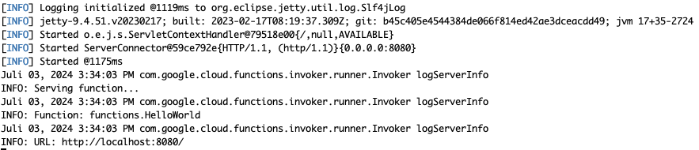

# Google Cloud Functions mit HTTP-Trigger in Java

In dieser Aufgabe werden wir eine Google Cloud Functions-Anwendung bereitstellen, die über einen HTTP-Trigger ausgeführt werden kann.

## Projekt vorbereiten

Für Google Cloud Functions muss eine Reihe von APIs im GCP-Projekt aktiviert sein.
Wechseln Sie als erstes im Browser in das GCP-Projekt, in dem Sie arbeiten möchten. 
Rufen Sie dann folgende URL auf:

https://console.cloud.google.com/apis/enableflow?apiid=cloudfunctions.googleapis.com,%20%20%20%20%20cloudbuild.googleapis.com,artifactregistry.googleapis.com,%20%20%20%20%20run.googleapis.com,logging.googleapis.com

Dies wird die benötigten APIs aktivieren.

## Java-Projekt anlegen und vorbereiten

Erstellen Sie ein neues Maven-Projekt.
```sh
mvn archetype:generate -DgroupId=com.example -DartifactId=gcf -DarchetypeArtifactId=maven-archetype-quickstart -DinteractiveMode=false
cd gcf
```

Fügen Sie danach in der POM folgende `dependency` und folgende `build`-Config hinzu:

```xml
<dependencies>
    <dependency>
        <groupId>com.google.cloud.functions</groupId>
        <artifactId>functions-framework-api</artifactId>
        <version>1.1.0</version>
        <scope>provided</scope>
    </dependency>
</dependencies>
```

```xml
<build>
<plugins>
  <plugin>
    <groupId>com.google.cloud.functions</groupId>
    <artifactId>function-maven-plugin</artifactId>
    <version>0.11.0</version>
    <configuration>
      <functionTarget>functions.HelloWorld</functionTarget>
    </configuration>
  </plugin>
</plugins>
</build>
```

## Main-Klasse hinzufügen
Legen sie im Verzeichnis `src/main/java/functions` eine neue Datei `HelloWorld.java` mit folgendem Code ein:

```java

package functions;

import com.google.cloud.functions.HttpFunction;
import com.google.cloud.functions.HttpRequest;
import com.google.cloud.functions.HttpResponse;
import java.io.BufferedWriter;
import java.io.IOException;

public class HelloWorld implements HttpFunction {
  // Simple function to return "Hello World"
  @Override
  public void service(HttpRequest request, HttpResponse response)
      throws IOException {
    BufferedWriter writer = response.getWriter();
    writer.write("Hello World!");
  }
}
```

## Funktion lokal ausführen

Um zu testen, ob die Funktion korrekt aufgesetzt ist, können Sie im Projektverzeichnis folgenden Befehl ausführen:
```shell
mvn function:run
```
Sie werden aufgefordert, die Funktion im Browser aufzurufen:



## Funktion deployen

Um die Funktion in der Google Cloud zu deployen, führen Sie zuletzt folgende Befehle aus. Bitte ersetzen Sie die Projekt-ID passend.

```shell
gcloud auth login
gcloud config set project YOUR_PROJECT_ID
gcloud functions deploy java-http-function \
    --gen2 \
    --entry-point=functions.HelloWorld \
    --runtime=java17 \
    --region=europe-west1 \
    --source=. \
    --trigger-http \
    --allow-unauthenticated
```

Wenn Sie dabei Fehler wie den folgenden erhalten, müssen Sie den Befehl wiederholen:

```shell
Enabling service [cloudbuild.googleapis.com] on project [my-firebase-project-428308]...
Operation "operations/acf.p2-635965646353-abf09b33-b8a4-457f-9cee-16a51aed30ad" finished successfully.
ERROR: (gcloud.functions.deploy) ResponseError: status=[404], code=[Ok], message=[Service account projects/-/serviceAccounts/635965646353-compute@developer.gserviceaccount.com was not found.]
```
Hintergrund ist dass die notwendigen Service Accounts erst nach dem Aktivieren der APIs angelegt werden. Wenn Sie weiter oben alle APIs aktiviert haben, sollten Sie hier allerdings nicht mehr in solche Fehler laufen. 

Wenn die Funktion erfolgreich deployt wurde, erhalten Sie die folgende Ausgabe:

```shell
state: ACTIVE
updateTime: '2024-07-03T13:41:15.155204213Z'
url: https://europe-west1-my-firebase-project-428308.cloudfunctions.net/java-http-function
```
Die URL wird entsprechend anders aussehen. Rufen Sie die Seite auf und prüfen Sie das Ergebnis.

