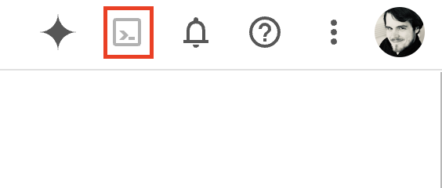
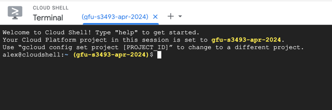
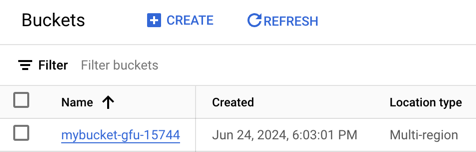
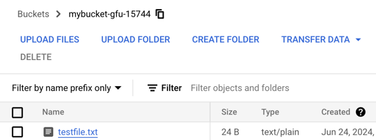

# Erstes Arbeiten mit Cloud Shell

## Schritt 1: Shell öffnen
Starten Sie Cloud Shell über den Button oben in der Menüleiste



Es wird nun einige Zeit dauern, bis die Shell einsatzbereit ist. Sobald Sie eine Eingabeaufforderung erhalten wie im nächsten Bild gezeigt, können Sie fortfahren.



## Schritt 2: Git-Reposity clonen

Auf Cloud Shell sind eine ganze Reihe von Tools vorinstalliert – zum Beispiel git. Testen wir dies, indem wir ein Git-Repository clonen.
Geben Sie den folgenden Befehl ein:

```shell
git clone https://gitlab.com/it-erben/gfu/gcp.git
cd gcp
less README.md
```

Sie sollten nun eine Textdatei sehen. Mit "q" können Sie `less` wieder verlassen.

## Schritt 3: Erste Schritte mit dem gcloud-CLI

Probieren Sie folgende Befehle aus. Sie werden wahrscheinlich gefragt, ob Cloud Shell Zugriff auf Ihren Google-Account erhalten darf. Bejahen Sie die Frage. 
Prüfen Sie nach jedem Befehl das Ergebnis und schauen Sie auf die verlinkten Artikel in der Cloud SDK-Dokumentation.

```shell
gcloud --version
gcloud config list # https://cloud.google.com/sdk/gcloud/reference/config/list
gcloud config get-value project # https://cloud.google.com/sdk/gcloud/reference/config/get
```

## Schritt 4: Anlegen eines Google Cloud Storage-Buckets

Google Cloud Storage lernen wir später im Kurs genauer kennen. Für jetzt reicht es zu verstehen, dass Cloud Storage ein Objektspeicher ist, in dem sich Dateien hoch- und herunterladen lassen, ohne vorher Speicherplatz angefragt haben zu müssen.

Führen Sie folgenden Befehl in der Cloud Shell aus:
```shell
export BUCKET_NAME="mybucket-gfu-$RANDOM"
gsutil mb gs://$BUCKET_NAME
```
Sie haben nun einen Bucket angelegt mit einem zufälligen Namen.
Bucket-Namen müssen in Cloud Storage global eindeutig sein, daher haben wir einen zufälligen Namensteil eingebaut.

Der neue Bucket ist nun einsatzbereit und Sie können eine Datei hochladen.

```shell
echo "Das ist eine Testdatei." > testfile.txt
gsutil cp testfile.txt gs://$BUCKET_NAME
```

Nun wollen wir über die Konsole prüfen, ob die Datei hochgeladen wurde.
Geben Sie in der Suchleiste "Cloud Storage" ein und wählen Sie den Menüpunkt aus, der erscheint.
Es erscheint eine Liste aller Buckets des aktuellen Projekts.



Wählen Sie den gerade angelegten Bucket aus. Die Datei sollte sich nun in der Liste wiederfinden.



Damit ist die Aufgabe abgeschlossen. Herzlichen Glückwunsch!
