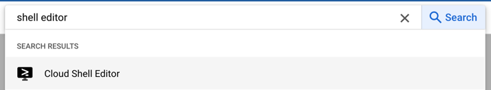
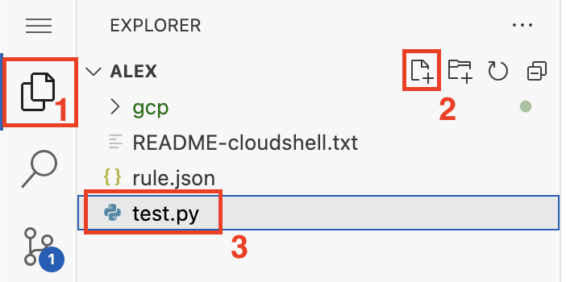

# Arbeiten mit dem Cloud Shell Editor

In dieser Aufgabe lernen Sie den Cloud Shell Editor kennen. Dazu werden Sie aufbauend auf die Aufgabe in [cloud-shell-basics](../cloud-shell-basics) ein Python-Skript schreiben, welches den Inhalt eines Cloud Storage-Buckets ausgibt.

## Schritt 1: Shell Editor öffnen

Öffnen Sie den Cloud Shell Editor über die Menüleiste oben in der Konsole.


Nun wird ggf. erst eine Shell gestartet und Sie müssen einen Moment warten. Machen Sie sich mit dem Editor und dem Menü vertraut – es ähnelt stark Visual Studio Code.

## Schritt 2: Python-Skript anlegen

Legen Sie in der Explorer-Ansicht des Editors eine neue Datei an. Der Name ist beliebig, muss aber auf .py enden.



## Schritt 3: Quellcode einfügen

Fügen Sie folgenden Code in die neue Datei ein:

```python
from google.cloud import storage

def list_buckets_with_details():
    # Erstellen eines Clients
    client = storage.Client()

    # Liste aller Buckets im aktuellen Projekt abrufen
    buckets = client.list_buckets()

    # Ausgabe der wichtigsten Einstellungen für jeden Bucket
    for bucket in buckets:
        print(f"Bucket Name: {bucket.name}")
        print(f"Location: {bucket.location}")
        print(f"Storage Class: {bucket.storage_class}")
        print(f"Created: {bucket.time_created}")
        print(f"Updated: {bucket.updated}")
        print(f"Versioning Enabled: {bucket.versioning_enabled}")
        print(f"Labels: {bucket.labels}")
        print(f"Lifecycle Rules: {bucket.lifecycle_rules}")
        print("------------")

if __name__ == "__main__":
    list_buckets_with_details()
```

## Schritt 4: Terminal öffnen und Programm testen
Kopieren Sie den absoluten Pfad der Python-Datei, indem sie auf die Datei im Dateibrowser mit der rechten Maustaste klicken und "Copy Path" wählen.

Öffnen Sie eine neue Shell-Sitzung.


Installieren sie das Python 3-SDK für Google Cloud Storage

```shell
pip3 install google-cloud-storage
```
Führen Sie nun das Programm aus. Ersetzen Sie zuvor den oben ermittelten Pfad in unten stehendem Befehl.
```shell
/bin/python3 /home/alex/test.py # Dateipfad entsprechend anpassen
```
Damit ist die Aufgabe abgeschlossen. Herzlichen Glückwunsch!
