# Aufgabe für GCP-Kurs: GCS-Bucket, Service Account, VM (Konsole)

In dieser Aufgabe erstellen Sie einen Service Account, einen Storage Bucket und
eine VM. Sie lernen, wie sie korrekt die notwendigen Berechtigungen zur
Verwendung des Buckets vergeben.

## Erstellen eines GCS-Buckets

Wechseln Sie über die Suchleiste auf die Cloud Storage-Ansicht.

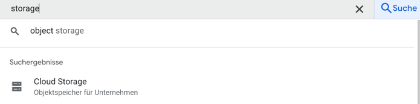

---

Klicken Sie auf "Bucket erstellen"


---

Wählen Sie einen beliebigen Namen. Als Location wählen Sie bitte "eu".

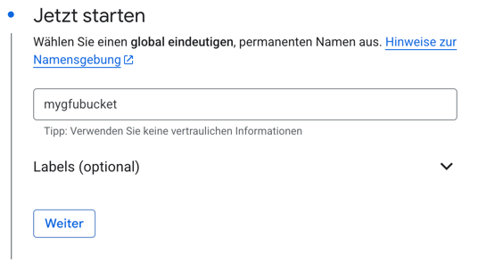
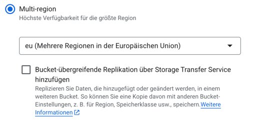

---

Sie können alle anderen Einstellungen belassen wie Sie sind und die Anlage
abschließen. Auch den Dialog, dass öffentlicher Zugriff deaktiviert wird,
können Sie bestätigen.

## Erstellen eines Service Accounts

Navigieren Sie über die Suchleiste in der Konsole auf die Dienstkonten-Ansicht.

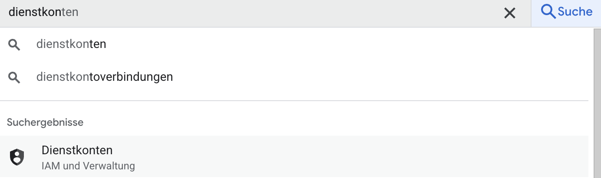

---

Klicken Sie auf "Dienstkonto erstellen".


---

Im nun folgenden Formular können Sie einen beliebigen Namen eingeben.

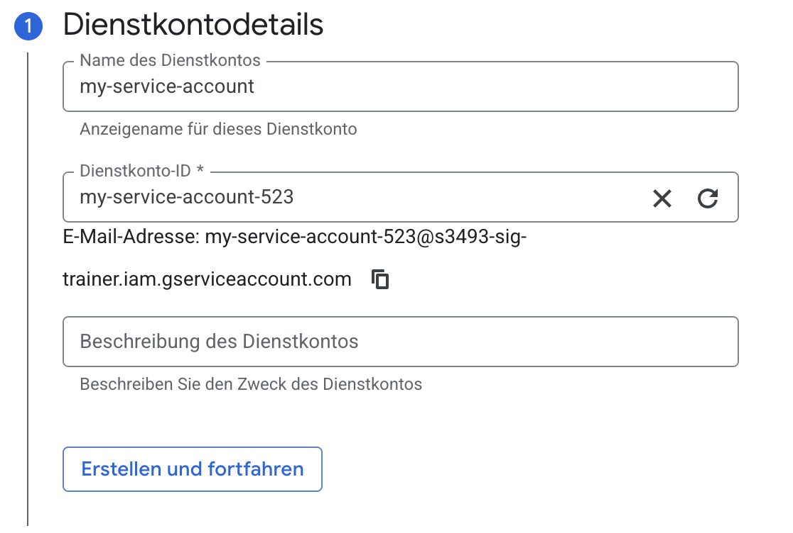

---

Klicken Sie auf "Erstellen und fortfahren".
Wählen Sie nun die Rolle "Storage-Administrator" aus. Bitte achten Sie darauf,
dass Sie wirklich exakt diese und nicht eine gleichlautende Rolle wählen.
Es ist außerdem wichtig, dass die nach der Wahl der Rolle einmal auf "Weiter"
klicken, damit die Rolle angewandt wird.

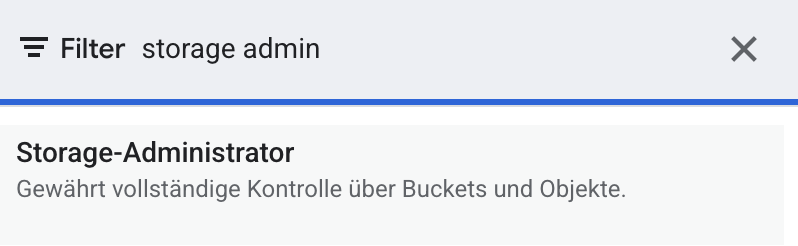

Sie können die Erstellung nun abschließen.

## Erstellen einer Compute Engine VM

Wechseln Sie über die Menüleiste in die Compute Engine-Ansicht.

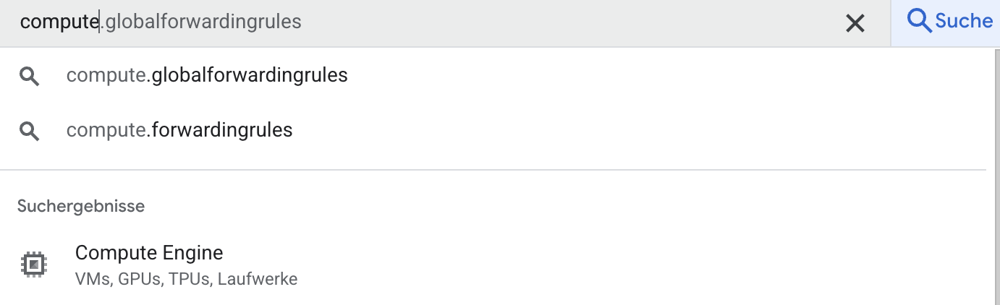

---

Klicken Sie auf "Instanz erstellen".


---

Wählen Sie einen beliebigen Namen und einen europäischen Standort (egal
welchen).

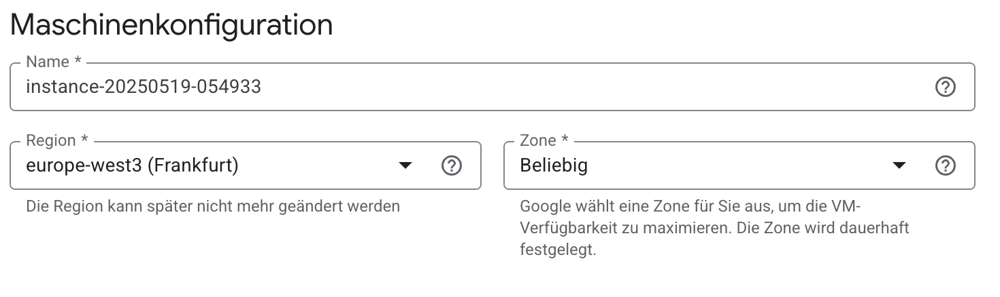

---

Als Instanztyp wählen sie e2-micro.

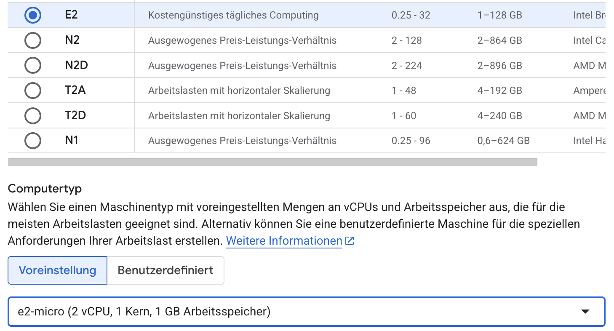

---

Klicken Sie links auf den Reiter "Sicherheit".

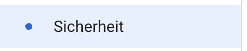

---

Wählen Sie den soeben angelegen Service Account aus.

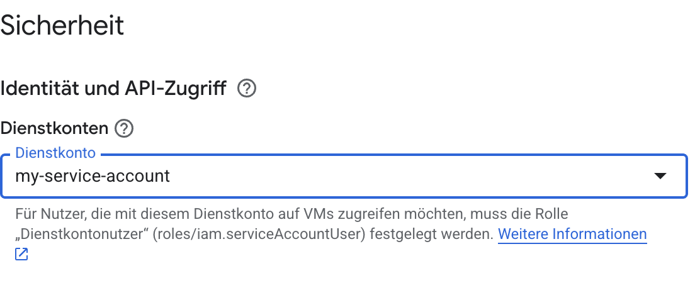

Sie können die Anlage nun abschließen.

## Verbinden per SSH

Um nun einen Test durchführen zu können, verbinden wir uns per SSH mit der VM.
Klicken Sie dazu auf den SSH-Knopf in der Liste der VMs.

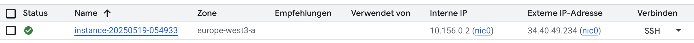

Zuletzt listen wir alle Buckets auf um zu testen, dass die Instanz
Vollberechtigung auf Google Cloud Storage hat.

```shell
gsutil ls
```
