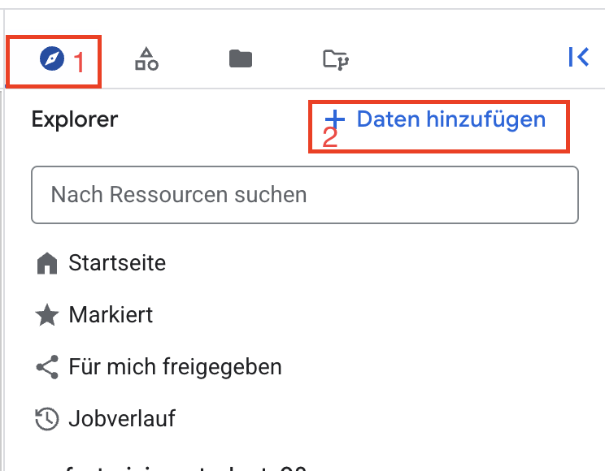
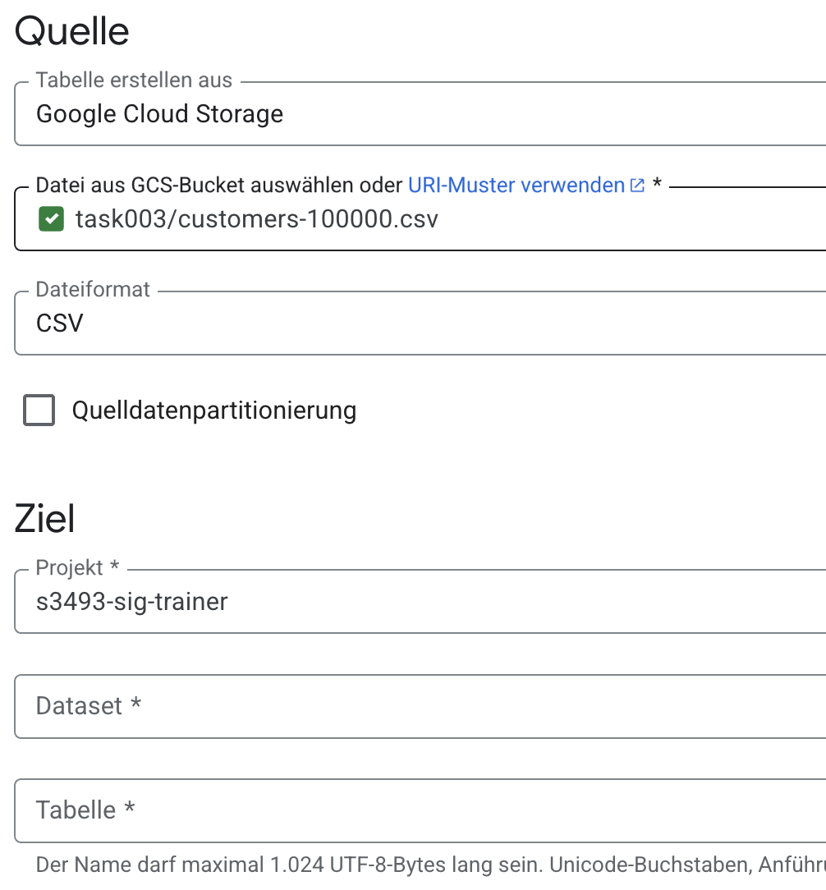
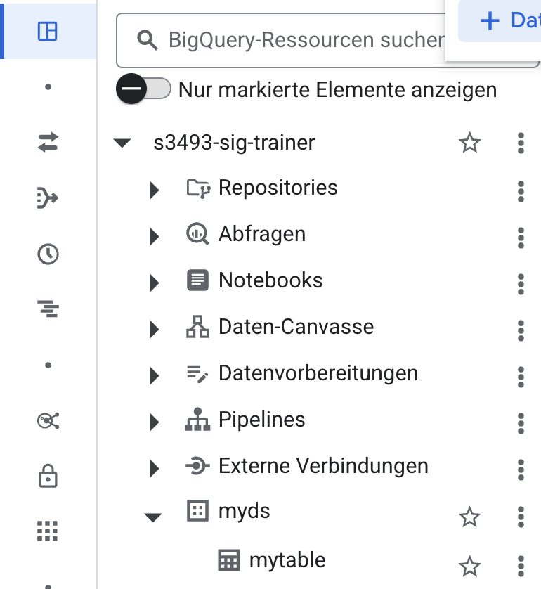

# 11 - Einbinden von Daten in BigQuery

In dieser Aufgabe werden Sie einen Storage-Bucket als externe Quelle in
BigQuery einbinden.

## Bucket erstellen

Erstellen Sie zunächst einen Storage-Bucket in der EU. Verwenden Sie die
Voreinstellungen, die bereits gegeben sind.

Laden Sie danach die Datei `customers-100000.csv` in den Bucket hoch. Die Datei
finden Sie [hier](../../material/bigquery/customers-100000.csv)

## Scan starten

Klicke auf "Daten hinzufügen"



---

Wähle "Google Cloud Storage"


---

Wähle den manuellen, externen Import


---

Wähle den Bucket und die Datei aus. Erstelle über das Menü ein Dataset namens
"myds" und eine Tabelle namens "customers".
Das Dataset muss in der EU liegen!



---

Aktiviere den Haken für automatische Schemaerkennung.


Du kannst den Dialog nun abschließen

---

Kehre in das Studio über das Menü auf der rechten Seite zurück – es ist der
erste Menüpunkt oben. Wähle im Baum deine Tabelle aus.



---

Starte das Abfragefenster.


---

Du kannst nun beliebige Testanfragen ausführen. Hier sind einige Ideen. Finde
heraus, was die Queries ergeben.
Bitte ersetze die Platzhalter vor dem Ausführen der Query. Beachte bitte die
separierenden Punkte. Es ist weiterhin wichtig, die richtigen Anführungszeichen
zu übernehmen – es handelt sich um Backticks für Spalten- sowie
Tabellen-Qualifizierer und einfache Anführungszeichen für Literale.

```sql
SELECT Country, COUNT(*) AS customer_count
FROM `GCP_PROJEKT_NAME.DATASOURCE_NAME.TABLE_NAME`
GROUP BY Country
ORDER BY customer_count DESC
LIMIT 5;
```

```sql
SELECT EXTRACT(YEAR FROM DATE(`Subscription_Date`)) AS year,
  COUNT(*) AS registrations
FROM `GCP_PROJEKT_NAME.DATASOURCE_NAME.TABLE_NAME`
GROUP BY year
ORDER BY year;
```

```sql
SELECT REGEXP_EXTRACT(Email, r'@(.+)$') AS domain, COUNT(*) AS count
FROM `GCP_PROJEKT_NAME.DATASOURCE_NAME.TABLE_NAME`
GROUP BY domain
ORDER BY count DESC
LIMIT 10;
```

```sql
SELECT
  Country,
  COUNT(*) AS customer_count,
  ROUND(COUNT(*) * 100.0 / SUM(COUNT(*)) OVER (), 2) AS percentage
FROM `GCP_PROJEKT_NAME.DATASOURCE_NAME.TABLE_NAME`
GROUP BY Country
ORDER BY customer_count DESC;
```

```sql
SELECT `First_Name`, `Last_Name`, `Phone_1`
FROM `GCP_PROJEKT_NAME.DATASOURCE_NAME.TABLE_NAME`
WHERE `Phone_1` LIKE '+%'
ORDER BY `Phone_1`;
```

Viel Spaß!
